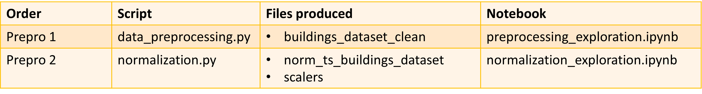
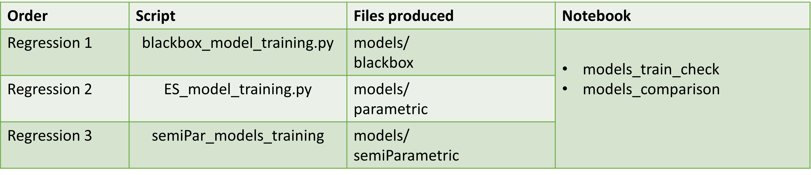
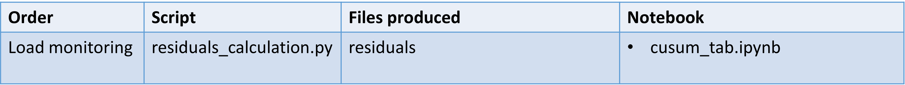

# A data-driven energy analysis framework to support energy efficiency of the Telecommunication sector

This repository includes the Python scripts and Jupyter Notebooks necessary to preprocess electrical load data, train regression models, and perform anomaly detection for industrial buildings. In particular, the data regarding Telecommunication buildings, and more in detail, Data Centers electrical demand are considered. The original data were retrieved from a set of real and simulated buildings. In the first case, hourly measurements have been obtained by monitoring of the total electrical demand of the buildings, along with weather data. In the case of simulated buildings, the electrical behavior is simulated by means of a RC thermal model, whose assumpionts are described in the PhD Thesis named "A data-driven energy analysis framework to support energy efficiency of the Telecommunication sector".

The framework first allows preprocessing of data, including data filtering and normalization. Then, regression models are trained, according to three different approaches, namely non-parametric, parametric and semi-parametric models. Finally, anomaly detection is performed thanks to CUSUM-based electrical load control charts. 

## Data
Public data to test the pipeline are made available at: https://zenodo.org/records/15691194 .
To run the pipeline, download the data and put the file into the directory data/datasets/raw data .

## Pipeline

The user is provided with:
-3 packages, for the different steps of the pipeline: "preprocessing", "regression", and "load_monitoring".
-Each package contains scripts, for data processing and models training, and notebook.
-The initial data are provided, while the successive elaboration and the models are not included in the repository. They can be easily obtained by running the scripts, following the pipeline order described in the following figures.

## 👥 Authors

Simone Eiraudo, Politecnico di Torino

## 📝 Citation
TODO: add citation
